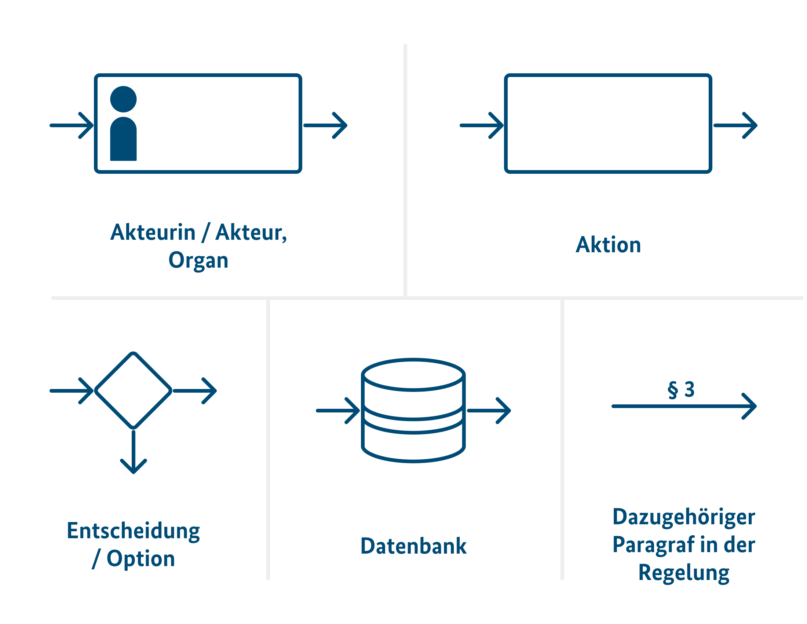

Version 1.3 – 07.05.2024

### Schritt 2 des Digitalcheck
# Hilfestellungen, um ein digitaltaugliches Regelungsvorhaben zu erarbeiten

### ZUSAMMENGEFASST

Im zweiten Schritt geht es darum, dass Sie **Ihr Regelungsvorhaben so digitaltauglich wie möglich formulieren**. In diesem Schritt haben Sie den größten Einfluss auf die Digitaltauglichkeit. Nutzen Sie daher aktiv den Gestaltungsspielraum, den Sie am Anfang der Arbeit an einem Vorhaben haben.

- Visualisieren Sie die Umsetzung Ihrer Regelungsidee (möglichst vor der ersten Verschriftlichung).
- Beziehen Sie andere Blickwinkel ein.
- Orientieren Sie sich an den fünf Prinzipien für digitaltaugliche Gesetzgebung.
- Arbeiten Sie mit der begleitenden Dokumentation. Fangen Sie damit früh an. Diese schicken Sie zur Prüfung der Digitaltauglichkeit an das NKR-Sekretariat. **Dieser Schritt ist verbindlich.**

### Visualisieren Sie die Umsetzung des Regelungsvorhabens

Eine Visualisierung der Umsetzung Ihres Regelungsvorhabens hilft Ihnen dabei, die Auswirkung der Umsetzung auf Betroffene* besser zu verstehen. Zusammenhänge werden sichtbar und Sie können Möglichkeiten der Digitalisierung in der Umsetzung identifizieren.

_* Von dem Regelungsvorhaben Betroffene sind jene, die selbst Zielgruppe des Vorhabens sind oder für die sich Rahmenbedingungen durch dieses Regelungsvorhaben ändern._

Visualisieren Sie vor der ersten Textarbeit, um Aspekte der Digitaltauglichkeit frühzeitig zu erkennen und bei der Verschriftlichung Ihres Regelungsvorhabens berücksichtigen zu können.

#### Vorteile von Visualisierungen
- Visuelle Darstellungen komplexer Sachverhalte sind schneller und intuitiver erfassbar als Text.
- Beim Visualisieren setzen Sie sich mit digitalen Möglichkeiten auseinander, dadurch entstehen neue Lösungen.
- Visualisierungen helfen bei der Kommunikation Ihrer Regelungsidee (z. B. in Abstimmungen, Gesprächen mit Umsetzungsinstanzen).
- Eine digitale Umsetzung schafft neue Möglichkeiten und erfordert dadurch andere Prozesse, die sich gut visuell abbilden lassen (z. B. Zusammenfassung von Schritten durch Automatisierung, Datenabgleich/-austausch, Entscheidungslogiken).
- Eine Visualisierung hilft Ihnen, Logikbrüche, Medienbrüche, Inkonsistenzen, offene Verfahrensenden, Schleifen, uneinheitliche Rechtsbegriffe zu erkennen. Sie kann Ihnen außerdem dabei helfen, vermeidbare Schriftformerfordernisse oder analoge Nachweise zu erkennen und zu vermeiden.

#### Welche Art der Visualisierung geeignet ist
Es gibt unterschiedliche Arten der Visualisierung (oft auch Notationen genannt). Je nach Zielsetzung eignen sich unterschiedliche Visualisierungen: etwa Nutzerreisen, Entscheidungsbäume oder Datenflüsse. Für die Darstellung von Prozessen gibt es standardisierte Methoden, wie z. B. BPMN (Business Process Modeling Notation) oder den Standard des Föderalen Informationsmanagement (FIM). Wenn Sie bisher nicht mit Visualisierungen gearbeitet haben, empfehlen wir Ihnen ein Flussdiagramm.

#### Visualisierungen des Bestandsrechts
Gegebenenfalls liegen bereits Visualisierungen des Bestandrechts für Ihr Regelungsvorhaben vor, z.B. FIM-Prozessmodelle. Unter Anderem bei der Bundesredaktion können Sie nach bestehenden Visualisierungen für Ihr Regelungsvorhaben fragen: [Bundesredaktion@bmi.bund.de](mailto:bundesredaktion@bmi.bund.de)

#### So erstellen Sie ein Flussdiagramm
Notieren Sie, wer an der Umsetzung beteiligt ist, und welche Aufgaben und Zuständigkeiten entstehen. Fragen Sie sich:
- Wer oder was ist beteiligt? (z. B. Bürger oder Bürgerin, eine Behörde, ein IT-System, IT-Fachverfahren, oder IT-Anwendung)
- Was passiert? (z. B. prüft Angaben, sendet Daten)
- Wann passiert etwas? (z. B. zeitliche oder prozessuale Abhängigkeit)
- Wo passiert etwas? (z. B. Medium, Format, Ort, Datenbank)
- Warum passiert etwas? (Hinweis auf den Paragrafen)

Der Start mag Ihnen leichter fallen, wenn Sie als Basis eine zeitliche Abfolge wählen. Wenn Sie mit Stift und Papier beginnen, finden Sie nachfolgend hier einige Elemente, die Sie nutzen können:

Mehr zur Visualisierung mit Flussdiagrammen finden Sie hier: [ondea.de/DE/ZfL/ZfL_node.html](https://www.ondea.de/DE/ZfL/ZfL_node.html), Modul 10 im Video “Visualisierung“.

#### Wenn die erste Skizze steht: Nutzen Sie die fünf Prinzipien für digitaltaugliche Gesetzgebung

Markieren Sie in Ihrer Visualisierung, in welchen Schritten die fünf Prinzipien (s. Seite 6 in diesem Dokument) für digitaltaugliche Gesetzgebung relevant sein könnten. Gehen Sie dabei Prinzip für Prinzip durch. Lassen Sie die gewonnenen Erkenntnisse in die digitaltaugliche Gestaltung des Regelungsvorhabens einfließen.

#### Arbeiten Sie von grob zu fein

Beginnen Sie mit reduzierten Informationen und ergänzen Sie nach und nach Details in Ihrer Visualisierung. Fangen Sie wortwörtlich mit Stift auf Papier an. Im Mittelpunkt steht der Nutzen der Visualisierung, nicht das verwendete Programm oder die perfekte Anwendung einer Notationsform.

#### Hier bekommen Sie Hilfe

In Ihrem Referat, in Ihrem Ministerium oder in nachgelagerten Behörden kann es Kolleginnen und Kollegen geben, die bereits mit Visualisierungen arbeiten oder an einem der Digitalcheck Workshops teilgenommen haben. Bitten Sie sie um Unterstützung oder wenden Sie sich an das Digitalcheck Team (0151 4076 7839, [digitalcheck@digitalservice.bund.de](mailto:digitalcheck@digitalservice.bund.de)).

#### Die Darstellungen helfen auch denen, die Ihr Regelungsvorhaben umsetzen

Personen, die Ihre Regelungen digital umsetzen (z. B. Programmiererinnen und Programmierer), denken in Prozessen, Strukturen, Systemen und Zusammenhängen. Eine Visualisierung des Umsetzungsprozesses hilft Ihnen beim Verstehen und Übersetzen Ihrer Regelungsvorhaben und verbessert die Umsetzung.

Hängen Sie Ihre Visualisierung – schon einfache Scans oder Fotos von Skizzen – Ihrem Regelungsentwurfs an und erleichtern Sie Ihren Kolleginnen und Kollegen z.B. in der Ressortabstimmung oder dem NKR das Verständnis ihres Vorhabens.

#### Tipp: Schaffen Sie ein gemeinsames Verständnis
Visualisieren Sie gemeinsam. Arbeiten Sie mit Kolleginnen und Kollegen aus Ihrem Referat und anderen Abteilungen zusammen, um Auswirkungen auf angrenzende Rechtsbereiche zu verstehen. Wichtiges Praxiswissen kann von Expertinnen und Experten, Mitarbeitern in den zuständigen Behörden sowie von den betroffenen Bürgerinnen und Bürgern als auch von Unternehmen eingeholt werden. Die Zusammenarbeit schafft ein gemeinsames Verständnis des Regelungsvorhabens und der Umsetzungsmöglichkeiten. Die Diskussion ist häufig ebenso wertvoll wie die entstandene Visualisierung selbst.

### Beziehen Sie andere Blickwinkel ein 

#### Sprechen Sie mit denen, die Ihr Regelungsvorhaben umsetzen 

Überlegen Sie, wer für die Umsetzung Ihres Regelungsvorhabens zuständig ist. Verstehen Sie so früh wie möglich die Anforderungen derer, die das Regelungsvorhaben in digitale Anwendungen umsetzen und mit diesen arbeiten werden. Dieses Praxiswissen ermöglicht eine reibungslose Umsetzung.

- Definieren Sie, wer Ihr Regelungsvorhaben umsetzt. Für einen strukturierten Überblick
eignen sich bspw. Stakeholder-Karten.
- Analysieren Sie die Anforderungen derjenigen, die an der Umsetzung Ihres Regelungsvorhabens beteiligt sind. Welche Prozesse oder IT-Systeme gibt es bereits? Müssen diese angepasst werden und wie viel Zeit oder Kapazität steht dafür zur Verfügung? Über welches Wissen und Erfahrung verfügen die Mitarbeitenden? Gibt es bestehende (Open Source-) Software (z.B. IT-Fachverfahren)?
- Überlegen Sie, ob und wie Ihr Regelungsvorhaben digital umgesetzt wird. Welche Daten können nachgenutzt werden? Muss dafür eine Rechtsgrundlage geschaffen werden? Welche Daten oder Prozesse müssen neu geschaffen werden und wer ist dafür zuständig? Wie lange wird die Umsetzung etwa dauern, und welche zeitlichen Abhängigkeiten ergeben sich daraus? Welche Chancen und Hürden sehen Sie für die Beteiligten und deren Rahmenbedingungen?

#### Sprechen Sie mit denen, die von der Umsetzung betroffen sind

Um frühzeitig die Bedürfnisse derer zu erfahren, für die ihr Regelungsvorhaben geschrieben wird, empfehlen wir, persönliche Gespräche mit Betroffenen zu führen. So stellen Sie sicher, dass das Wirkungsziel tatsächlich erreicht wird. In fünf bis sechs informellen Gesprächen können Sie bereits wertvolle Erkenntnisse sammeln. Von der Umsetzung Betroffene sind jene, die selbst Zielgruppe des Regelungsaspekts sind, oder für die sich Rahmenbedingungen durch das Regelungsvorhaben ändern.

Beispiele hierfür:
- Bürgerinnen und Bürger, die eine Leistung beantragen oder Unterlagen einreichen.
- Behörden, die eine (digitale) Leistung selbst anwenden.
- Unternehmen, die Informationen bereitstellen oder Dokumentationen anfertigen.
- Weitere Organisationen, die Daten bereitstellen.

#### Ziehen Sie Expertinnen und Experten hinzu

Zusätzliche Expertise in den Bereichen Digitalisierung, Datenschutz, Barrierefreiheit und Gestaltung von Dienstleistungen kann Ihnen dabei helfen, konkrete Fragen zu beantworten und die digitale Umsetzung besser zu verstehen. Das gibt Ihnen wichtige Impulse zu Aspekten, die Sie bei der Erarbeitung Ihres Regelungsvorhabens bedenken sollten. Expertise finden Sie unter anderem direkt in Ihrem Haus: In jedem Ministerium arbeiten Expertinnen und Experten beispielsweise zu Datenschutz und Barrierefreiheit. In diesen Themen hilft Ihnen auch der Bundesbeauftragte für den Datenschutz und die Informationsfreiheit (BfDI). Kolleginnen und Kollegen, die schon einmal ein ähnliches Vorhaben bearbeitet haben, können Ihnen ggf. ebenso weiterhelfen. Auch auf das Fachwissen in nachgelagerten Behörden können Sie zurückgreifen oder externe Expertise aus Wissenschaft, Wirtschaft und Zivilgesellschaft einbinden.

Sie können auch die Digital- & Umsetzungsexpertise des Digitalcheck Teams für eine vertrauliche Beratung und Unterstützung in Anspruch nehmen. Je früher in Ihrem Vorhaben Sie auf das Beratungsangebot zukommen, desto besser kann das Team Sie unterstützen. (0151 4076 7839, [digitalcheck@digitalservice.bund.de](mailto:digitalcheck@digitalservice.bund.de))

#### Tipp: Arbeiten Sie im Team

Gemeinsam mit anderen gelingt es Ihnen besser, alle relevanten Aspekte und Blickwinkel für digitaltaugliche Regelungen zu identifizieren. Tauschen Sie sich darum beispielsweise für die Vorprüfung mit Personen aus Ihrem Referat aus oder erstellen Sie Visualisierungen in der Gruppe.

### Orientieren Sie sich an den fünf Prinzipien für digitaltaugliche Gesetzgebung

Nutzen Sie die fünf Prinzipien für digitaltaugliche Gesetzgebung bei der Arbeit am Regelungsvorhaben:

1. Digitale Kommunikation sicherstellen
2. Wiederverwendung von Daten & Standards ermöglichen
3. Datenschutz & Informationssicherheit gewährleisten
4. Klare Regelungen für eine digitale Ausführung finden
5. Automatisierung ermöglichen

Sie finden die Prinzipien in detaillierter Ausführung und mit Beispielen versehen in der begleitenden Dokumentation und als A4-Poster auf [digitalcheck.bund.de](https://digitalcheck.bund.de).

Funktionsweise und Hintergrund der Prinzipien werden in diesem Blogbeitrag erklärt: [digitalservice.bund.de/blog/digitalcheck-fuenf-prinzipien-fuer-digitaltaugliche-gesetze](https://digitalservice.bund.de/blog/digitalcheck-fuenf-prinzipien-fuer-digitaltaugliche-gesetze)

### Arbeiten Sie mit der begleitenden Dokumentation des Digitalcheck

Die begleitende Dokumentation greift die anderen Methoden zur Erarbeitung digitaltauglicher Regelungen auf: die Visualisierung des Vollzugs, das Einbeziehen anderer Blickwinkel und die fünf Prinzipien der Digitaltauglichkeit. Die besten Ergebnisse erhalten Sie, wenn Sie sich bereits in der Recherche mit der begleitenden Dokumentation auseinandersetzen. Neue Erkenntnisse tragen Sie fortlaufend ein, damit Ihre Kolleginnen und Kollegen und der NKR Ihre Entscheidungen zur Digitaltauglichkeit nachvollziehen können.

Die begleitende Dokumentation unterstützt Sie dabei, **alle Aspekte der Digitaltauglichkeit zu berücksichtigen.** Sie finden sie hier: [digitalcheck.bund.de](https://digitalcheck.bund.de).

---

# Der Digitalcheck:
## Digitaltaugliche Regelungsvorhaben erarbeiten

### Was sind digitaltaugliche Regelungsvorhaben?

Digitaltaugliche Regelungsvorhaben ermöglichen die **einfache und wirkungsorientierte Umsetzung** von Regelungsgegenständen, indem sie digitale Möglichkeiten zum Nutzen aller Beteiligten ausschöpfen. Beteiligte sind in diesem Zusammenhang Bürgerinnen und Bürger, Einwohnende, die Verwaltung, Unternehmen und weitere Organisationen wie zum Beispiel Vereine.

Digitaltaugliche Regelungsvorhaben sind somit ein grundlegendes Element für eine erfolgreiche Digitalisierung in allen Lebensbereichen. Der Nationale Normenkontrollrat (NKR) prüft gemäß seines Auftrags, ob die Digitaltauglichkeit Ihres Regelungsentwurfes nachvollziehbar geprüft ist und veröffentlicht das Ergebnis im Rahmen seiner Stellungnahme. 

Der Digitalcheck gilt für alle Regelungsvorhaben (Gesetze, Verordnungen und Verwaltungsvorschriften), sowohl für neue Vorhaben als auch für Änderungen an bestehenden Regelungen.

### Der Digitalcheck wird stetig verbessert

Der Digitalcheck wird iterativ erarbeitet und kontinuierlich verbessert – auch auf Grundlage Ihrer Rückmeldungen. Wenn Sie also Verbesserungsvorschläge oder Ideen haben, melden Sie sich gern per E-Mail beim Digitalcheck Team: [digitalcheck@digitalservice.bund.de](mailto:digitalcheck@digitalservice.bund.de)

**Bitte benutzen Sie die aktuelle Version.** Diese finden Sie hier: [digitalcheck.bund.de](https://digitalcheck.bund.de)

### DIE SCHRITTE DES DIGITALCHECK

1. Mit der Vorprüfung (in diesem Dokument) schätzen Sie den Digitalbezug Ihres Regelungsvorhabens ein.

2. **Mit den Hilfestellungen (in diesem Dokument) erarbeiten Sie ein digitaltaugliches Regelungsvorhaben.**

Benötigen Sie Hilfe? Sie erreichen uns unter [digitalcheck@digitalservice.bund.de](mailto:digitalcheck@digitalservice.bund.de) oder 0151 4076 7839. Wir helfen Ihnen weiter.

Version 1.3 - 07.05.2024 | Bitte benutzen Sie die aktuelle Version der Dokumente. Diese finden Sie hier: [digitalcheck.bund.de](https://digitalcheck.bund.de)
